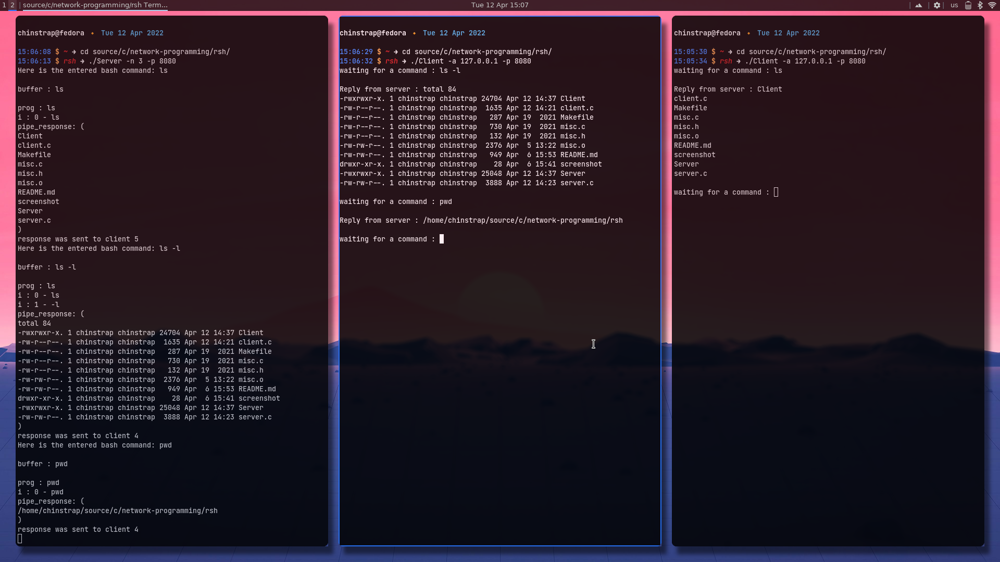

<br />
<p align="center">
  <a href="https://github.com/umutsevdi/remote-sh">
    
  </a>

  <h3 align="center">remote-sh</h3>

  <p align="center">
    Remote Shell implementation in C programming language.
</p>

---

## Project Details 
This project is the first assignment of "Advanced Network Programming" Lecture. Our goal is to implement a program that can remotely execute given tasks with their arguments.




## Getting Started

Simply run `make` command in the directory. Then you can use Server and Client programs.

Server takes 2 parameters, port number(-p) and max shell connection(-n).
Client takes 2 parameters, IP address and port number(-p)

```sh
./Server -n 3 -p 8081
```
```sh
./Client -a 127.0.0.1 -p 8081
```
### Requirements
Any computer with a UNIX based operating system can run both of the programs.

## 5- Contact
Project Link: [umutsevdi/graduate-information-system](https://github.com/umutsevdi/graduate-information-system)
